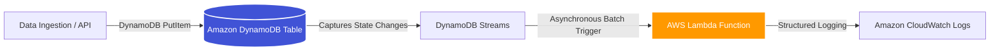

# Event-Driven Architecture: DynamoDB $\rightarrow$ Lambda (Terraform)


---

## Overview
This repository implements a production-grade, asynchronous, serverless event pipeline on AWS using Terraform. It ingests transactional data via Amazon DynamoDB and dynamically triggers a decoupled AWS Lambda compute step via DynamoDB Streams.
This decoupling pattern isolates data absorption from the processing logic, ensuring high throughput, operational resilience, and zero resource starvation on downstream interfaces.

---

## Architecture Diagram


## Architectural Pillars & Core Patterns

* **Asynchronous Micro-Batching (Scalability):** Rather than tying compute resources to synchronous client requests, data is offloaded to a sequential stream layer. This protects processing units from horizontal scaling bottlenecks during traffic spikes.
* **Least-Privilege Identity Isolation (Security):** The AWS Lambda execution context is bound to a custom IAM role explicitly locked down to read stream checkpoints and write log streams, adhering strictly to the principle of zero-trust least privilege.
* **On-Demand Infrastructure (Cost Optimization):** The DynamoDB layer is provisioned in `PAY_PER_REQUEST` execution mode, coupled with zero-idle serverless Lambda functions. Operational costs scale linearly with usage-collapsing to absolute zero during idle periods.

---

## Technologies Used

* **Amazon DynamoDB:** High-performance, schema-agnostic NoSQL storage layer.
* **DynamoDB Streams:** Append-only transaction log stream emitting `NEW_IMAGE` state modification vectors.
* **AWS Lambda:** Serverless Python 3.9 compute handler executing isolated processing events.
* **Amazon CloudWatch:** Real-time logging framework providing audit controls and telemetry.
* **Terraform (IaC):** Explicit declarative blueprint mapping cloud resources and access planes.

```bash
terraform/
├── main.tf            # Core AWS Resource Orchestration & Event Source Mappings
├── terraform.tf       # Provider Locks & State Locking Configurations
└── lambda_function.py # Python-based Asynchronous Stream Event Handler
```


